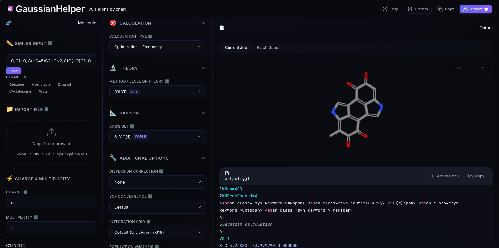

# GaussianHelper

**Current version: v0.2-alpha**

GaussianHelper is a modern, responsive web application designed for computational chemists to prepare Gaussian Job Files (`.gjf`) and construct/manage sequential batch calculation workflows.

It runs entirely client-side, providing a fast, graphical tool for setting up inputs without any software dependencies. It also supports zero-installation local server launching to bypass CORS security policies.



---

## 🌟 Key Features

- **3D Structure Viewer**: Interactive, premium 3D visualization using ball-and-stick, stick, or spacefill models.
- **Conformer Generator**: Generate 3D coordinates instantly from any chemical SMILES string.
- **Multi-Format Coordinate Parser**: Import structures from `.xyz` coordinate files, standard `.mol` / `.sdf` structures, or ChemDraw `.cdxml` drawings (extracting atomic positions, scaling coords, and handling implicit hydrogens).
- **Theory Level Recommendations**: Smart recommendations for method/basis set combinations based on the calculation type (geometry optimization, energy, frequency, etc.) — helps users pick the right level of theory without deep DFT expertise.
- **理论 & Parameter Setups**: Visual inputs for standard Link 0 commands (memory, processors, checkpoints), job types, method functionalities, basis sets, SCF models, integration grids, dispersion, solvation, and population analyses.
- **Batch Generator & Queue**: Compile multiple calculation configs in a sequence queue, customize inputs/outputs inline, and export them as:
  - **Windows Batch Control Files** (`.bcf`) for Gaussian's native queuing.
  - **Linux Shell Scripts** (`.sh`) for sequential terminal executions (includes start/end timestamp echoes and completion checks).
- **CORS-Bypassing Portable Launchers**:
  - `run.bat` for Windows (uses native PowerShell and .NET listener).
  - `run.sh` for Linux (uses system-native Python 3/2 HTTP server).

---

## 🛠️ Developer Setup & Commands

To set up the development environment, make sure you have [Node.js](https://nodejs.org) installed on your system.

### 1. Install Dependencies
```bash
npm install
```

### 2. Run Local Development Server
Starts a hot-reloading dev server using Vite:
```bash
npm run dev
```

### 3. Run Unit Test Suite
Runs the Vitest suite headlessly to verify elements, validation rules, GJF generation, and coordinate parser logic:
```bash
npm test
```

### 4. Build and Package Production Assets
Compiles the client-side code and automatically generates portable distribution archives `dist.zip` and `dist.tar.gz` via our custom postbuild step:
```bash
npm run build
```

---

## 🚀 How to Launch the Portable App (Offline / Zero-Install)

No software installation is required.

### 💻 Windows
1. Extract the `dist.zip` archive.
2. Double-click the `run.bat` script.
3. This opens `http://localhost:8080` in your default browser. Close the console when done to stop the local server.

### 🐧 Linux
1. Extract `dist.tar.gz` or `dist.zip`.
2. Open a terminal inside the directory and run:
   ```bash
   ./run.sh
   ```
3. This spins up Python's built-in server and opens the browser. Hit `Ctrl+C` to terminate the server.

## 🤖 AI Disclaimer
* **Note**: This project has been developed with the assistance of agentic artificial intelligence (AI) models. While the application, files parsers, and input generators have been tested, users are advised to verify their generated Gaussian Job Files (`.gjf`) and execution scripts before running calculations on production clusters.

---

## 📄 License & Credits
* **Developer & Credits**: Developed by **xharl**.
* **License**: Released under the **GNU General Public License v3 (GPLv3)**. See `LICENSE` for details.
